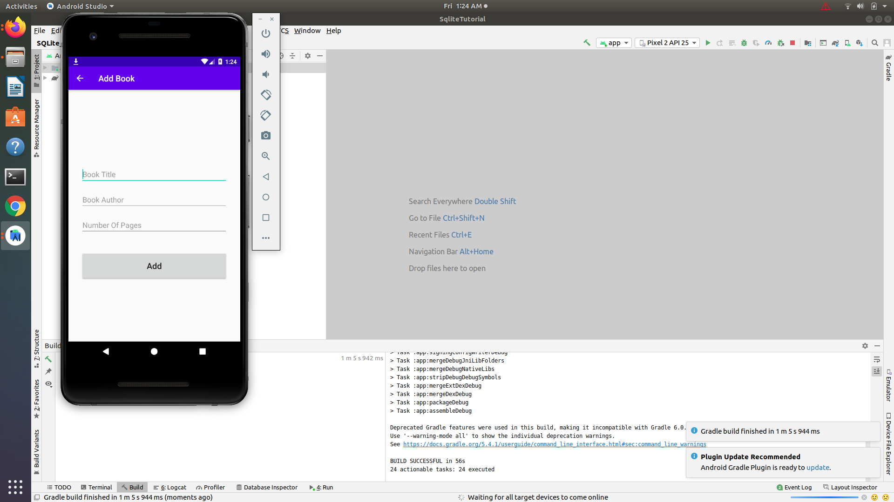
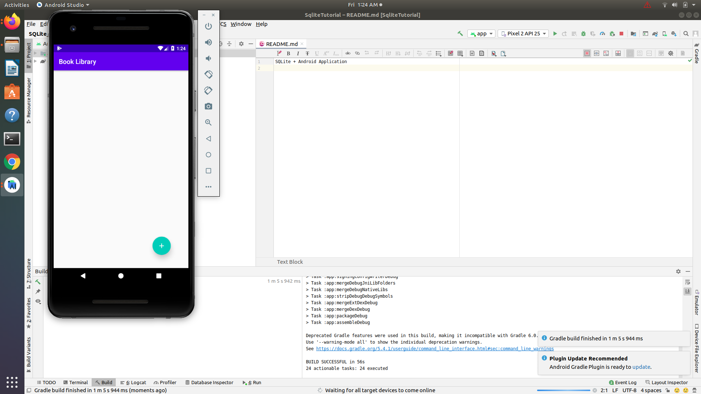

# sqlite-android-application
This android application build using sqlite.
This is simple book library application which contains name of book ,authour name,pages of book.

Screenshot 1:

Screenshot 2 :

Screenshot 3 :

